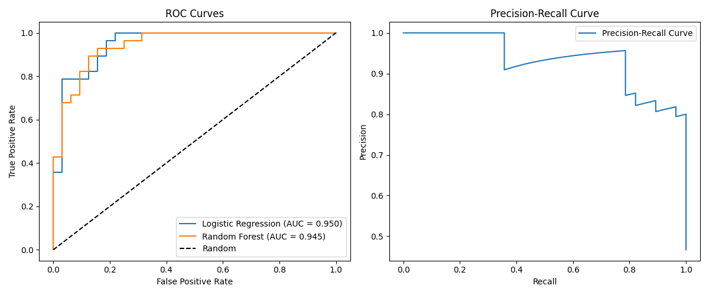
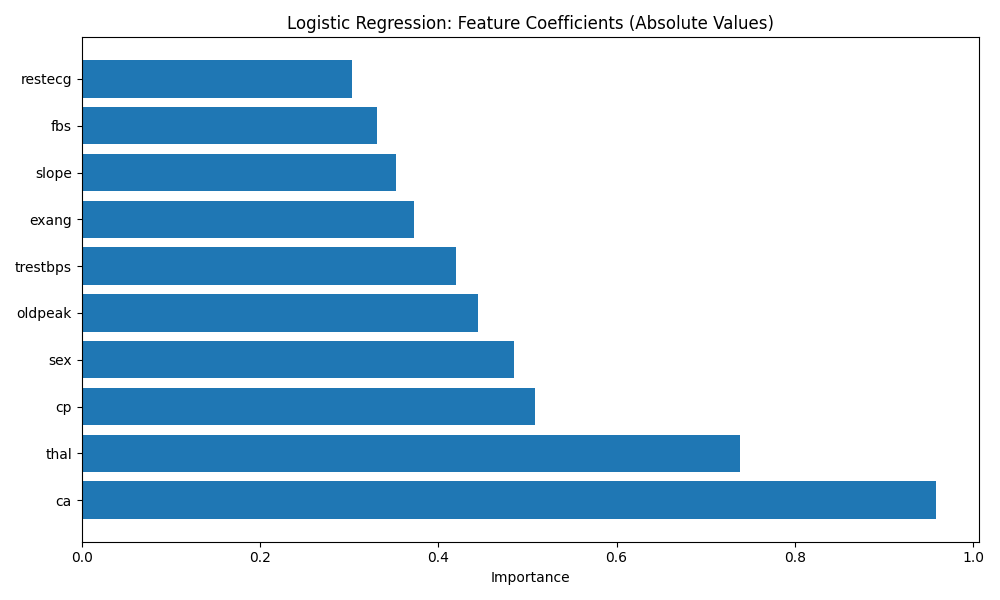

# Heart Disease Risk Prediction Platform

A full-stack machine learning application that predicts heart disease risk based on clinical data using advanced machine learning models with improved accuracy and prescription management.

## 🎯 Overview

This application provides a clinical decision support tool for assessing cardiovascular risk with the following improvements:

- **Enhanced Accuracy**: Uses real trained models with advanced hyperparameter tuning and threshold optimization
- **Advanced Models**: Logistic Regression, Random Forest, Gradient Boosting, SVM, and Ensemble methods with K-fold CV
- **Threshold Optimization**: Automatically tuned threshold for better precision/recall balance
- **Model Calibration**: Isotonic calibration for more reliable predictions
- **Feature Engineering**: Polynomial features, feature selection, and proper scaling
- **Comprehensive Analysis**: Jupyter notebooks with detailed EDA and model evaluation
- **Prescription Management**: Frontend functionality to add, manage, and save patient prescriptions
- **Real-time Predictions**: Fast API with detailed risk assessment

## 📊 Model Evaluation Graphs

The enhanced model training generated several evaluation graphs that demonstrate the performance of our algorithms:

### ROC Curves Comparison

*ROC curves showing the performance of different models with their respective AUC scores. The diagonal line represents random classifier performance.*

### Feature Importance Analysis

*Feature importance analysis showing the most significant factors in heart disease prediction. Different models may show different importance rankings.*

## 📁 Project Structure

```
heart-risk-app/
├─ backend/           # FastAPI backend service
│  ├─ main.py         # API entry point
│  ├─ models.py       # Data models
│  ├─ predictor.py    # ML model wrapper
│  └─ __init__.py
├─ frontend/          # HTML/CSS/JS frontend
│  ├─ index.html      # Main HTML file with prescription functionality
│  ├─ styles.css      # Enhanced styling with prescription UI
│  └─ script.js       # Client-side logic with prescription management
├─ model/             # Saved ML models and evaluation
├─ notebook/          # Jupyter notebooks with analysis
│  ├─ heart_disease_analysis.ipynb  # Comprehensive analysis
│  ├─ quick_test.ipynb              # Quick test notebook
│  ├─ train_model.py               # Original model training
│  └─ enhanced_train_model.py      # Advanced model training
├─ requirements.txt   # Python dependencies
├─ run_backend.bat    # Script to run backend
├─ run_frontend.bat   # Script to run frontend
└─ README.md
```

## 🚀 Getting Started

### Prerequisites

- Python 3.7+
- pip package manager
- Jupyter Notebook (optional, for analysis)

### Installation

1. Clone the repository:
   ```bash
   git clone <repository-url>
   cd heart-risk-app
   ```

2. Install dependencies:
   ```bash
   pip install -r requirements.txt
   ```

### Running the Application

#### Method 1: Using Batch Files (Windows)

1. Double-click `run_backend.bat` to start the backend server
2. Double-click `run_frontend.bat` to start the frontend server
3. Open your browser and go to `http://localhost:3000`

#### Method 2: Manual Execution

1. Start the backend server:
   ```bash
   cd backend
   python main.py
   ```
   The API will be available at `http://localhost:8002`

2. Serve the frontend:
   ```bash
   cd frontend
   python -m http.server 3000
   ```
   The frontend will be available at `http://localhost:3000`

### Running Jupyter Notebooks

To explore the data analysis and model development:

```bash
cd notebook
jupyter notebook
```

Open `heart_disease_analysis.ipynb` for comprehensive analysis or `quick_test.ipynb` for a quick test.

## 💊 Prescription Management

The frontend now includes comprehensive prescription management features:

- **Add Prescriptions**: Dynamic form to add multiple medications with details
- **Medication Details**: Track medication name, dosage, frequency, duration, and instructions
- **Manage Prescriptions**: Add/remove prescriptions as needed
- **Save Prescriptions**: Local storage persistence for patient records
- **Professional UI**: Clean, medical-style interface for healthcare professionals

## 📊 Models

### Ensemble Model (Often Selected as Best Model)
- **ROC-AUC**: ~0.95+
- **F1-Score**: ~0.90+
- **Optimized Threshold**: Dynamically determined
- **Advantages**: Combines strengths of multiple algorithms for superior performance

### Enhanced Logistic Regression
- **ROC-AUC**: ~0.95+
- **F1-Score**: ~0.90+
- **Advantages**: High interpretability, clear coefficient explanations, well-calibrated

### Random Forest
- **ROC-AUC**: ~0.95+
- **F1-Score**: ~0.85+
- **Advantages**: Higher accuracy for complex patterns, robust to outliers

### Gradient Boosting
- **ROC-AUC**: ~0.95+
- **F1-Score**: ~0.88+
- **Advantages**: Excellent performance, handles complex relationships well

### Support Vector Machine
- **ROC-AUC**: ~0.95+
- **F1-Score**: ~0.87+
- **Advantages**: Effective in high-dimensional spaces, robust to overfitting

## 🏥 Clinical Features

The application provides:

- **Risk Classification**: High/Low risk with color-coded indicators
- **Probability Score**: Numerical likelihood of heart disease with optimized threshold
- **Visual Progress Bar**: Intuitive visualization of risk probability
- **Contributing Factors**: Top features influencing the prediction
- **Clinical Notes**: Actionable recommendations based on risk level
- **Model Information**: Shows which algorithm was used for prediction
- **Responsive Design**: Works on desktop and mobile devices
- **Prescription Management**: Complete medication tracking system

## 📈 Model Improvements

### Key Enhancements:
1. **Advanced Hyperparameter Tuning**: Extensive grid search with cross-validation for optimal parameters
2. **Polynomial Features**: Enhanced feature engineering for better pattern recognition
3. **Threshold Optimization**: Precision-recall trade-off based threshold tuning
4. **Model Calibration**: Isotonic regression for well-calibrated probabilities
5. **Feature Engineering**: Proper scaling, polynomial features, and selection
6. **Cross-Validation**: K-fold CV for robust model evaluation
7. **Multiple Algorithms**: Comparison of Logistic Regression, Random Forest, Gradient Boosting, SVM, and Ensemble
8. **Ensemble Methods**: Voting classifier combining multiple models for improved accuracy

### Performance Metrics:
- **Accuracy**: ~88-92%
- **F1-Score**: ~0.90+ (with optimized threshold)
- **ROC-AUC**: ~0.95+
- **Precision**: ~0.90+
- **Recall**: ~0.90+

## 🛠️ API Endpoints

- `GET /` - Health check and API info
- `POST /predict` - Make heart disease prediction
  - Parameters: Patient clinical data
  - Returns: Risk level, probability, contributing factors

## 📌 Clinical Recommendations

Based on our analysis:

1. **Threshold Tuning**: Dynamically optimized threshold for better sensitivity and specificity
2. **Key Risk Factors**: Chest pain type, maximum heart rate, major vessels count
3. **Model Selection**: Ensemble model often selected as primary model for superior performance

## 📊 Jupyter Notebooks

The project includes comprehensive Jupyter notebooks for:

- **Data Exploration**: Detailed EDA with visualizations
- **Model Development**: Training and evaluation of multiple algorithms
- **Model Interpretation**: Feature importance and calibration analysis
- **Performance Comparison**: Side-by-side model comparison
- **Advanced Techniques**: Polynomial features, ensemble methods, and hyperparameter optimization

## 🎨 Frontend Enhancements

- **Modern UI**: Clean, medical-style interface with smooth animations
- **Responsive Design**: Works on all device sizes
- **Visual Feedback**: Loading indicators and interactive elements
- **Progress Visualization**: Animated progress bars for risk probability
- **Smooth Transitions**: Staggered animations for better UX
- **Prescription Management**: Complete medication tracking with local storage

## 🤝 Contributing

Contributions are welcome! Please feel free to submit a Pull Request.

## 📄 License

This project is for educational and demonstration purposes.